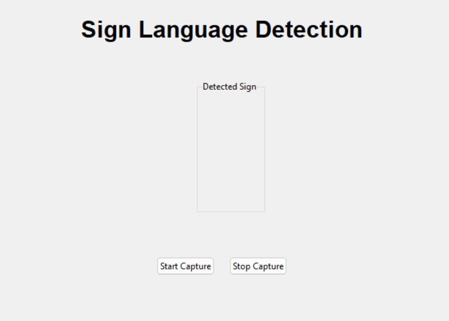
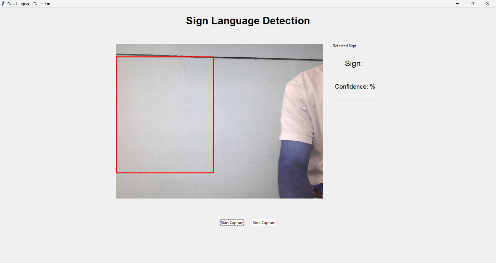
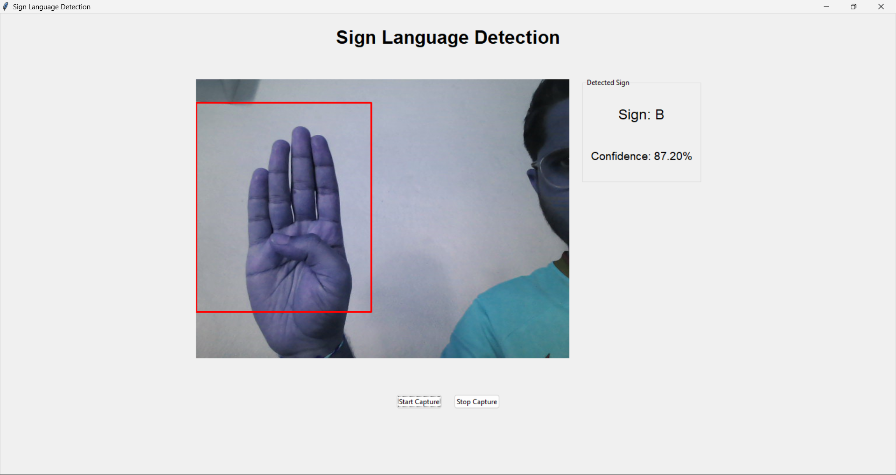

# Sign Language Recognition using Machine Learning



## Overview
This project is a Sign Language Recognition system that utilizes machine learning to identify and interpret sign language gestures. Built using TensorFlow and OpenCV, this system is designed to help bridge the communication gap for individuals who use sign language.

## Features
- **Real-time sign language detection**
- **High accuracy using LSTM neural networks**
- **User-friendly interface**
- **Supports multiple sign languages**

## Technology Stack
- **TensorFlow**: For machine learning model development
- **OpenCV**: For image processing
- **Keras**: High-level neural networks API
- **NumPy**: For numerical operations
- **Python**: Main programming language

## Installation
To run this project on your local machine, follow these steps:

1. **Clone the repository**:
    ```sh
    git clone https://github.com/your_username/SignLanguageRecognition.git
    cd SignLanguageRecognition
    ```

2. **Create a virtual environment**:
    ```sh
    python -m venv env
    source env/bin/activate  # On Windows, use `env\Scripts\activate`
    ```

3. **Install the required dependencies**:
    ```sh
    pip install -r requirements.txt
    ```

4. **Run the application**:
    ```sh
    python app.py
    ```

## Usage
1. **Start the application**:
    ```sh
    python app.py
    ```

2. **Interact with the interface**:
    - Use the webcam to capture sign language gestures.
    - The system will display the recognized signs in real-time.

## Screenshots



## Contributing
We welcome contributions to enhance the project! Please follow these steps to contribute:

1. Fork the repository.
2. Create a new branch (`git checkout -b feature-branch`).
3. Make your changes and commit them (`git commit -m 'Add some feature'`).
4. Push to the branch (`git push origin feature-branch`).
5. Open a pull request.


## Acknowledgments
- Thanks to the open-source community for their invaluable contributions.
- Special thanks to TensorFlow and OpenCV teams for their excellent libraries.

---

Feel free to reach out if you have any questions or suggestions!

Happy coding! 😊

